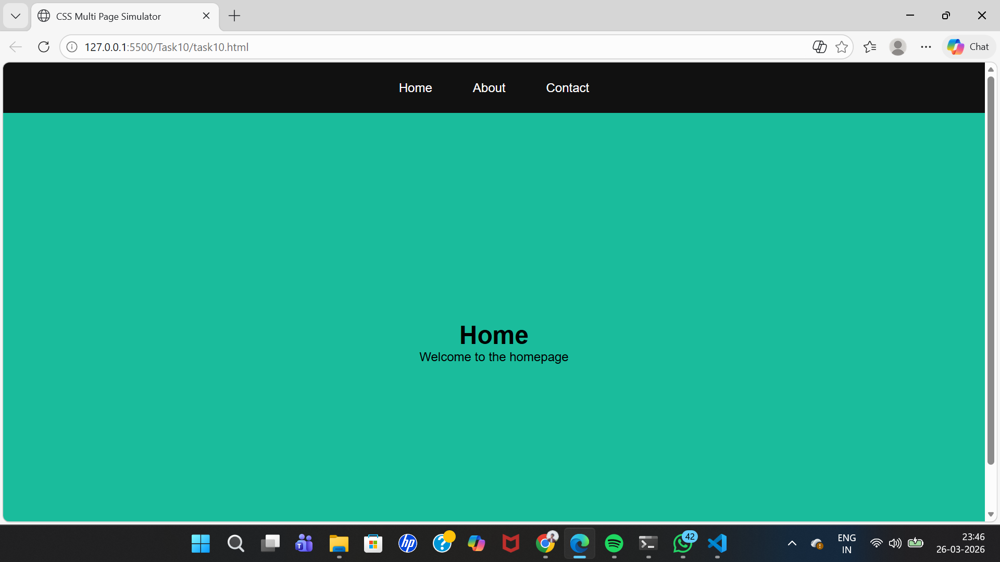

# Interactive Multi-Page Website Simulator with CSS Only

## Objective
Create a fully functional, multi-section website that simulates the experience of navigating between different pages—all without any JavaScript.

## Requirements
- Use the `:target` pseudo-class to display and hide different “pages” or sections of content.  
- Incorporate CSS animations and transitions to simulate page transitions (such as fading or sliding effects).  
- Design an accessible navigation menu that works across different devices and screen sizes.  
- Ensure that the entire experience is responsive and leverages advanced CSS techniques (e.g., combining Flexbox, Grid, and pseudo-classes) to manage layout and state transitions.

- [Output Link](https://drive.google.com/file/d/1kjnEkk8AiqbfPOyEkMy14CDe4hz9o-zm/view?usp=sharing)

### Output Screenshots

#### 1

#### 2

#### 3

