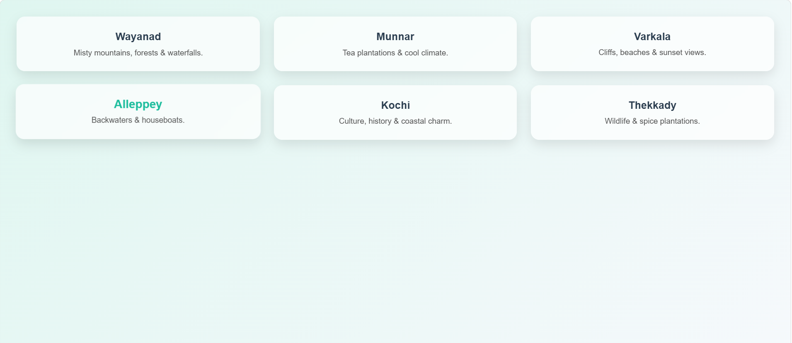
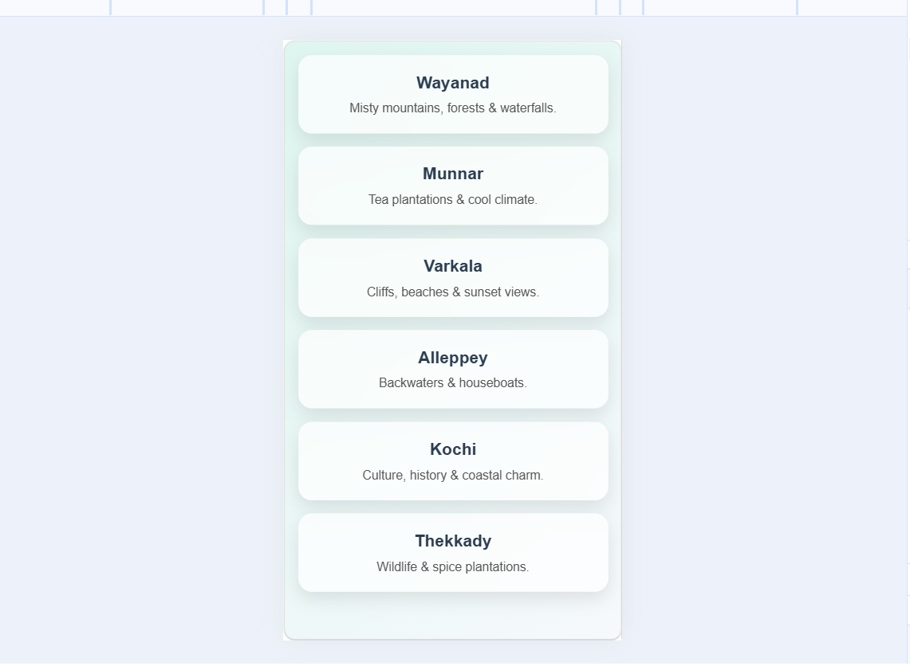
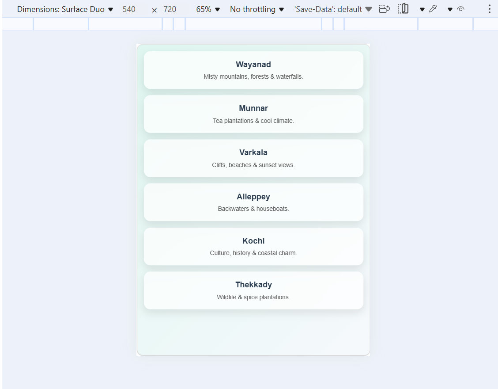

# Responsive Grid Layout

## Objective

Create a grid layout that displays multiple items.

## Requirements

- Use CSS Grid to arrange items in three columns on desktop screens.
- Adjust the grid to stack items in a single column on mobile devices using media queries.
- Ensure consistent spacing and alignment between items.

#### Output Screenshots

#### 1

#### 2

#### 3

