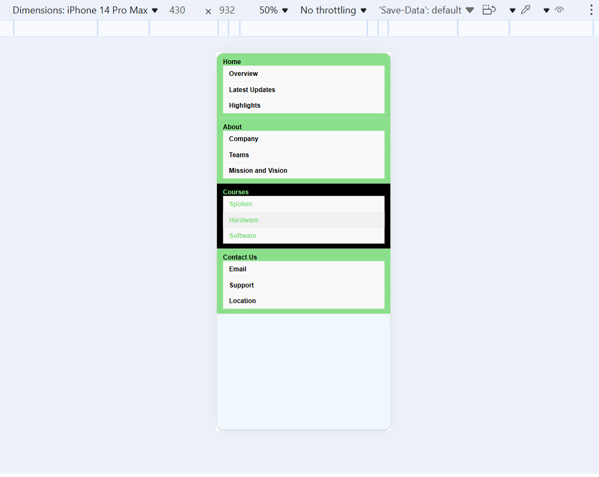

# Pure CSS Dropdown Menu

## Objective
Design a navigation bar with a dropdown submenu that appears on hover.

## Requirements
- Use nested `<ul>` elements for the menu and submenu.  
- Employ CSS pseudo-classes like `:hover` and transitions to create a smooth reveal effect.  
- Ensure that the menu looks good on both desktop and mobile (consider using a responsive fallback).

[Output Link](https://drive.google.com/file/d/1R4R4lQ70reQ5buUNIe6x-9SLabgXgyNr/view?usp=sharing)

### Output Screenshots

#### 1

#### 2

#### 3

#### 4

