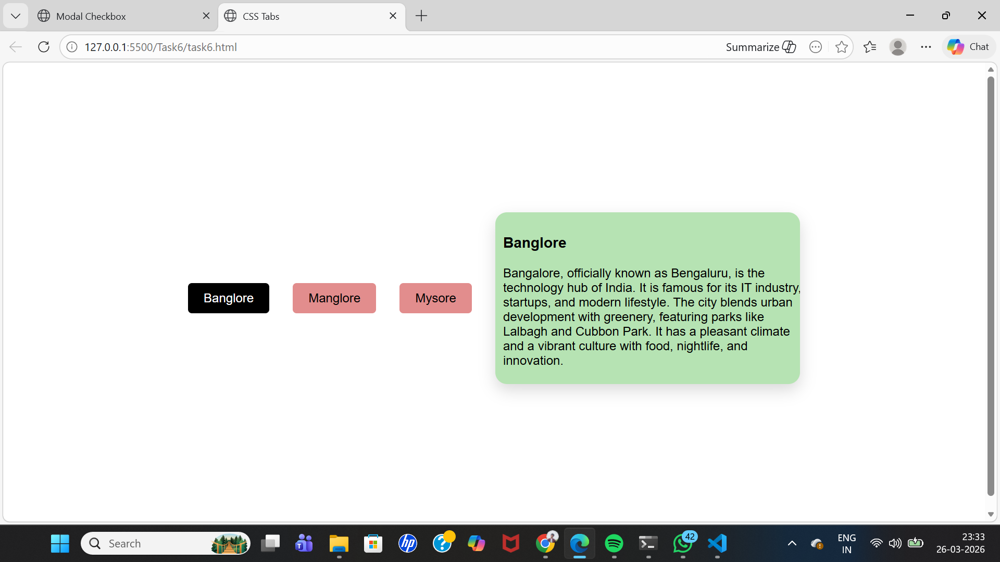
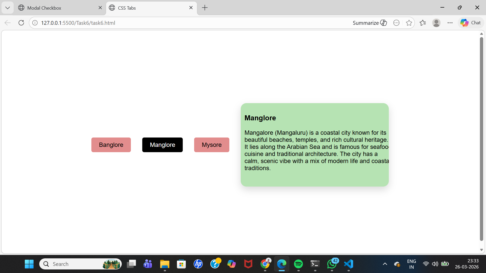
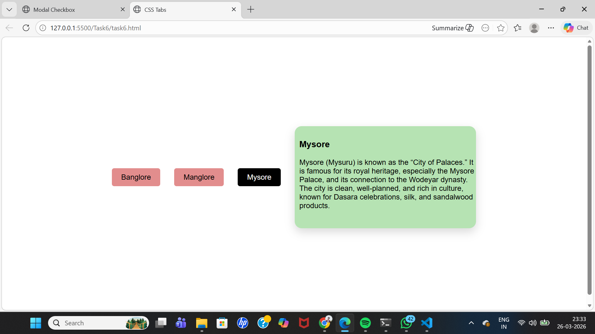

# Tabbed Content Interface

## Objective
Create a tabbed interface where clicking on a tab shows different content sections.

## Requirements
- Utilize radio buttons or checkboxes (hidden from view) along with labels to serve as tabs.  
- Use the `:checked` pseudo-class to display the corresponding content while hiding others.  
- Incorporate smooth transitions when switching between tabs.

[Output Link](https://drive.google.com/file/d/17osDukT4Oh7T5Lgh-57YT78VNV-xQfEo/view?usp=sharing)

### Output Screenshots

#### 1

#### 2

#### 3

