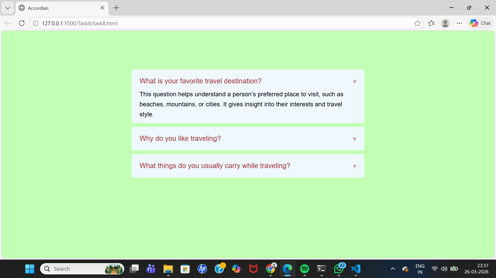
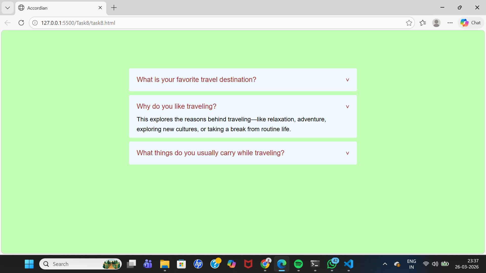
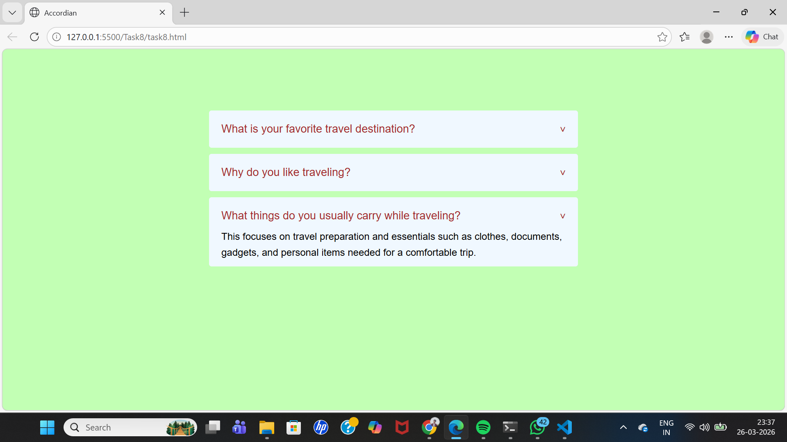

# CSS Accordion Component

## Objective
Build an accordion where content sections expand and collapse on click.

## Requirements
- Use the checkbox hack (a hidden checkbox input with a label) or the `:target` pseudo-class to control the open/closed state of each section.  
- Apply CSS transitions to animate the expansion and collapse of content areas.  
- Allow multiple sections to be open simultaneously (if desired) or restrict it to one open section at a time.

### Accordian
- Accordion is used to show and hide content in a collapsible format.
- It helps in saving space and makes the webpage look clean.
- Users can expand only the section they need.
- It improves readability and user experience on websites.

[Output Link](https://drive.google.com/file/d/1AjSQvZSjN6X8tZuG__oH4wtDWw11OJqA/view?usp=sharing)

### Output Screenshots

#### 1

#### 2

#### 3

